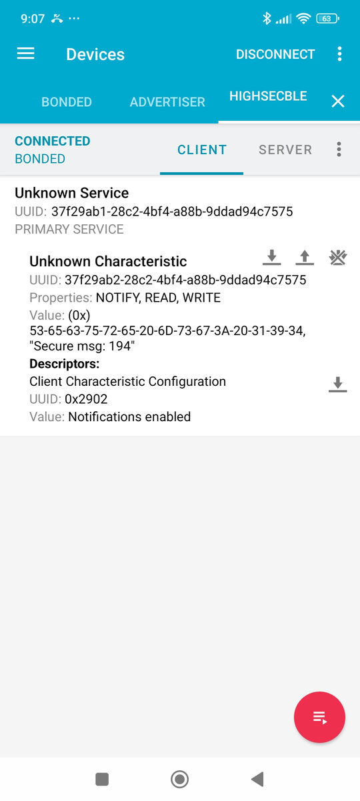

# Pico BLE Secure

A library for implementing secure Bluetooth Low Energy (BLE) pairing and encryption on Raspberry Pi Pico using the arduino-pico core.

## Overview

The `pico-ble-secure` library provides an easy-to-use interface for implementing secure BLE connections on Raspberry Pi Pico microcontrollers. It supports various security levels, pairing methods, and bond management.

This library extends the functionality of the arduino-pico core's BTstack implementation to make secure BLE connections more accessible to developers.

## Features

- **Multiple Security Levels:**
  - LOW: No encryption, no authentication
  - MEDIUM: Encryption without MITM protection ("Just Works" pairing)
  - HIGH: Encryption with MITM protection
  - HIGH_SC: Encryption with MITM protection and Secure Connections (highest security)

- **Flexible Pairing Methods:**
  - Just Works pairing
  - Passkey Display
  - Passkey Entry
  - Numeric Comparison

- **Bonding Support:**
  - Store and manage paired device information
  - Reconnect to previously bonded devices

- **Callback System:**
  - Receive notifications for all pairing events
  - Display pairing codes
  - Confirm pairing with numeric comparison
  - Automatic pairing management through connection callbacks

## Installation

### Using PlatformIO

1. Add this to your `platformio.ini` file:

```ini
[env:rpipicow]
platform = https://github.com/maxgerhardt/platform-raspberrypi.git
board = rpipicow
framework = arduino
board_build.core = earlephilhower
board_build.filesystem_size = 0.5m
build_flags = 
    -DPIO_FRAMEWORK_ARDUINO_ENABLE_BLUETOOTH
    -DPIO_FRAMEWORK_ARDUINO_ENABLE_IPV4
lib_deps = 
    pico-ble-secure
```

2. PlatformIO will automatically download and install the library.

### Manual Installation

1. Download the library as a ZIP file
2. In Arduino IDE: Sketch → Include Library → Add .ZIP Library
3. Select the downloaded ZIP file

## Requirements

- Raspberry Pi Pico W or Pico 2 W
- [Arduino-pico core](https://github.com/earlephilhower/arduino-pico) with BTstack support

## Optional Hardware
- I2C/SPI display for showing passkeys
- Buttons for user input (e.g., confirming numeric comparison)
  - Can use onboard [BOOTSEL button](https://arduino-pico.readthedocs.io/en/latest/bootsel.html)
- LEDs for visual feedback during pairing
  - Can use onboard LED
- Keypad or other input methods for entering passkeys

## Usage

### Basic Setup

```cpp
#include <Arduino.h>
#include <BTstackLib.h>
#include <BLESecure.h>

// Callbacks for BLE events
void bleDeviceConnected(BLEStatus status, BLEDevice* device) {
  if (status == BLE_STATUS_OK) {
    Serial.println("Device connected!");
    // No need to manually call BLESecure.requestPairing() here
    // It's automatically handled if requestPairingOnConnect is enabled
  }
}

void bleDeviceDisconnected(BLEDevice* device) {
  Serial.println("Device disconnected!");
}

void setup() {
  Serial.begin(115200);
  
  // Set device name
  BTstack.setup("SecureBLE");
  
  // Initialize BLE security with Numeric Comparison capability
  BLESecure.begin(IO_CAPABILITY_DISPLAY_YES_NO);
  
  // Set security level to HIGH - encryption with MITM protection
  BLESecure.setSecurityLevel(SECURITY_HIGH, true);
  
  // Request pairing automatically when a device connects
  BLESecure.requestPairingOnConnect(true);
  
  // Register connection callbacks through BLESecure (not BTstack)
  BLESecure.setBLEDeviceConnectedCallback(bleDeviceConnected);
  BLESecure.setBLEDeviceDisconnectedCallback(bleDeviceDisconnected);
  
  // Start advertising
  BTstack.startAdvertising();
}

void loop() {
  // Process BLE events
  BTstack.loop();
  
  delay(10);
}
```

### Connection Management

Register connection and disconnection callbacks through BLESecure instead of directly through BTstack:

```cpp
// Register callbacks through BLESecure for automatic pairing management
BLESecure.setBLEDeviceConnectedCallback(bleDeviceConnected);
BLESecure.setBLEDeviceDisconnectedCallback(bleDeviceDisconnected);
```

This allows the BLESecure library to automatically handle pairing requests based on your `requestPairingOnConnect` setting.

### Setting Up Security Level

Choose the appropriate security level for your application:

```cpp
// Just Works pairing (vulnerable to MITM attacks)
BLESecure.setSecurityLevel(SECURITY_MEDIUM, true);

// Secure pairing with MITM protection
BLESecure.setSecurityLevel(SECURITY_HIGH, true);

// Highest security with Secure Connections
BLESecure.setSecurityLevel(SECURITY_HIGH_SC, true);
```

### Pairing Callbacks

```cpp
// Callback for displaying passkey during pairing
void onPasskeyDisplay(uint32_t passkey) {
  Serial.print("Please enter this passkey on your device: ");
  Serial.println(passkey);
}

// Callback for numeric comparison during pairing
void onNumericComparison(uint32_t passkey, BLEDevice* device) {
  Serial.print("Do the following numbers match? ");
  Serial.println(passkey);
  
  // Get user confirmation (e.g., via button press)
  // Then accept or reject:
  BLESecure.acceptNumericComparison(true); // or false to reject
}

// Callback for pairing status updates
void onPairingStatus(BLEPairingStatus status, BLEDevice* device) {
  switch (status) {
    case PAIRING_IDLE:
      Serial.println("Pairing idle");
      break;
    case PAIRING_STARTED:
      Serial.println("Pairing started");
      break;
    case PAIRING_COMPLETE:
      Serial.println("Pairing complete - connection is now secure!");
      break;
    case PAIRING_FAILED:
      Serial.println("Pairing failed");
      break;
  }
}

void setup() {
  // ... other setup code ...
  
  // Register callbacks
  BLESecure.setPasskeyDisplayCallback(onPasskeyDisplay);
  BLESecure.setNumericComparisonCallback(onNumericComparison);
  BLESecure.setPairingStatusCallback(onPairingStatus);
}
```

## Migration Guide

### Version 1.X to 2.X

The 2.X version introduces a new way to handle connection events and automatic pairing. Here are the key changes:

1. **Connection Callbacks**: Register connection and disconnection callbacks through BLESecure instead of BTstack:
   ```cpp
   // Old way:
   BTstack.setBLEDeviceConnectedCallback(bleDeviceConnected);
   BTstack.setBLEDeviceDisconnectedCallback(bleDeviceDisconnected);
   
   // New way:
   BLESecure.setBLEDeviceConnectedCallback(bleDeviceConnected);
   BLESecure.setBLEDeviceDisconnectedCallback(bleDeviceDisconnected);
   ```

2. **Automatic Pairing**: When `requestPairingOnConnect(true)` is set, pairing is now automatically initiated when a device connects. You no longer need to manually check the flag and call `requestPairing()` in your connection callback:
   ```cpp
   // Old way:
   void bleDeviceConnected(BLEStatus status, BLEDevice* device) {
     if (status == BLE_STATUS_OK) {
       // Manually check and request pairing
       if (BLESecure._requestPairingOnConnect) {
         BLESecure.requestPairing(device);
       }
     }
   }
   
   // New way:
   void bleDeviceConnected(BLEStatus status, BLEDevice* device) {
     if (status == BLE_STATUS_OK) {
       // Pairing is automatically handled if enabled
       // No manual check needed
     }
   }
   ```

These changes simplify the code required to implement secure BLE connections and ensure consistent behavior across applications.

## Examples

The library includes several example platformIO projects demonstrating its usage:

- **SecurePairingMedium**: Basic encryption without MITM protection using the "Just Works" method
- **SecurePairingHigh**: Encryption with MITM protection using passkey or numeric comparison
- **SecurePairingHighSC**: The highest security level using Secure Connections

### Test with nRF Connect mobile app
- connect pico-W to computer with USB
- compile and upload the example platformio project
- open Serial Monitor in platformio
- open nRF Connect on your phone
- scan for devices
- connect to the Pico device
  - named either `MediumSecBLE`, `HighSecBLE`, or `HighSCSecBLE`
- follow the prompts for pairing
  - on android, you may see two popups for pairing (click both)
- for `HighSecBLE` and `HighSCSecBLE`, you will see a passkey on the Serial Monitor
  - enter the passkey on your phone before timeout 
- subscribe to the characteristic notifications to receive encrypted messages

     

## API Reference

### Class: BLESecureClass

#### Initialization

- `void begin(io_capability_t ioCapability = IO_CAPABILITY_DISPLAY_YES_NO)`: Initialize the security manager with specified IO capability

#### Security Configuration

- `void setSecurityLevel(BLESecurityLevel level, bool enableBonding = true)`: Set the security level for connections
- `void allowReconnectionWithoutDatabaseEntry(bool allow)`: Allow LTK reconstruction without a device DB entry (for peripheral role)
- `void setFixedPasskey(uint32_t passkey)`: Set fixed passkey (0-999999) or NULL for random

#### Pairing Control

- `void requestPairingOnConnect(bool enable)`: Request pairing automatically when a device connects
- `bool requestPairing(BLEDevice* device)`: Manually request pairing with a connected device
- `bool bondWithDevice(BLEDevice* device)`: Bond with a device (store keys for reconnection)
- `bool removeBonding(BLEDevice* device)`: Remove bonding information for a device
- `void clearAllBondings()`: Remove all stored bonding information

#### Connection Management

- `void setBLEDeviceConnectedCallback(void (*callback)(BLEStatus status, BLEDevice* device))`: Register callback for device connection events
- `void setBLEDeviceDisconnectedCallback(void (*callback)(BLEDevice* device))`: Register callback for device disconnection events

#### Callback Registration

- `void setPasskeyDisplayCallback(void (*callback)(uint32_t passkey))`: Callback for handling passkey display
- `void setPasskeyEntryCallback(void (*callback)(void))`: Callback for handling passkey entry requests
- `void setPairingStatusCallback(void (*callback)(BLEPairingStatus status, BLEDevice* device))`: Callback for pairing status updates
- `void setNumericComparisonCallback(void (*callback)(uint32_t passkey, BLEDevice* device))`: Callback for numeric comparison

#### Status and Control

- `void setEnteredPasskey(uint32_t passkey)`: Set passkey for entry method (call this from the passkey entry callback)
- `void acceptNumericComparison(bool accept)`: Accept or reject numeric comparison
- `BLEPairingStatus getPairingStatus()`: Get the current pairing status
- `bool isEncrypted(BLEDevice* device)`: Get the encryption status for a connection

## Compatibility

This library is designed for:
- Raspberry Pi Pico and Pico W
- Arduino-pico core with BTstack support

## License

This library is licensed under the MIT License - see the LICENSE file for details.

Note: This library depends on the arduino-pico core which is licensed under LGPL-2.1. 
When using this library, you must comply with the terms of both licenses.

## Contributing

Contributions to improve the library are welcome! Please submit pull requests or open issues on the repository.

## Acknowledgements and Credits
This library is based on the [BTstackLib](https://github.com/earlephilhower/arduino-pico/tree/master/libraries/BTstackLib) library for Arduino-Core and Raspberry Pi Pico. Special thanks to the BTstack developers for their work on BLE stack implementation and arduino-pico core maintainers.